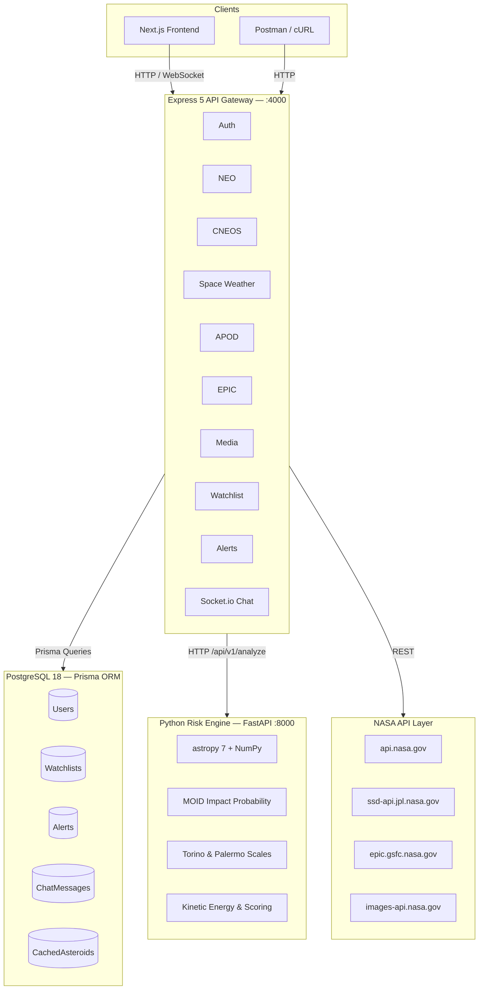
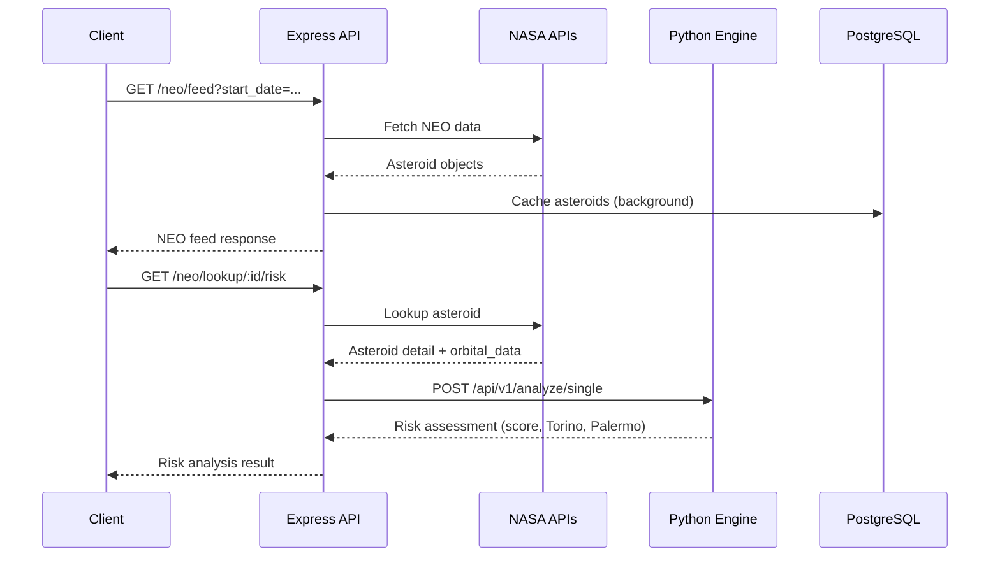
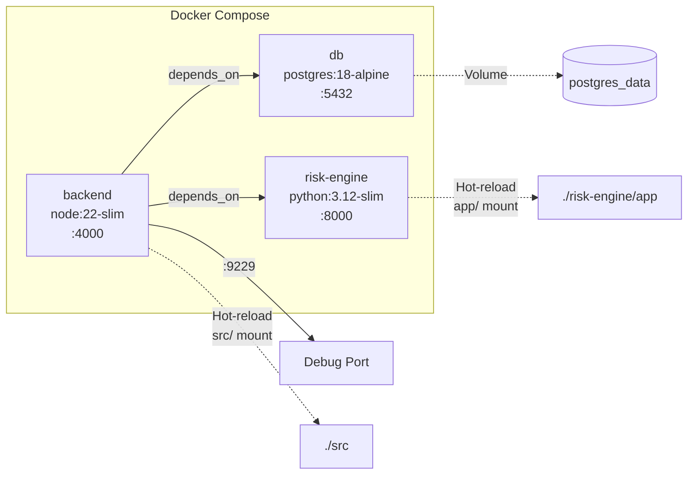
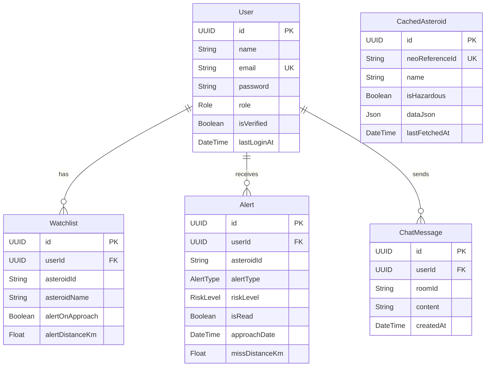

# 🌌 Cosmic Watch — Backend API

> **Real-Time Near-Earth Object Monitoring & Risk Analysis Platform**

[](https://www.typescriptlang.org/)
[](https://expressjs.com/)
[](https://www.prisma.io/)
[](https://www.postgresql.org/)
[](https://www.python.org/)
[](https://socket.io/)
[](https://docs.docker.com/compose/)
[](https://opensource.org/licenses/ISC)

Cosmic Watch is a full-stack platform that aggregates data from **6 NASA APIs**, runs real-time **asteroid risk analysis** through a scientific Python microservice (powered by [astropy](https://www.astropy.org/)), and delivers live updates via **WebSocket chat**. Built for the hackathon with production-grade architecture.

---

## Architecture



### Request Flow



---

## Tech Stack

| Layer | Technology |
|-------|-----------|
| **Runtime** | Node.js 22 + TypeScript 5.9 |
| **Framework** | Express 5 (v5.2.1) |
| **Database** | PostgreSQL 18 (Alpine) |
| **ORM** | Prisma 7 with `@prisma/adapter-pg` driver adapter |
| **Auth** | JWT (jsonwebtoken) + bcryptjs · RBAC (User / Researcher / Admin) |
| **Validation** | Zod 4 |
| **Real-time** | Socket.io 4 (WebSocket chat rooms) |
| **Risk Engine** | Python 3.12 + FastAPI 0.115 (microservice) |
| **Scientific** | astropy 7 · NumPy · SciPy · scikit-learn |
| **Logging** | Pino + pino-http (structured JSON) |
| **Linting** | Biome 2 + Husky + lint-staged |
| **Containers** | Docker Compose — 3 services, multi-stage builds |

---

## API Surface

| Metric | Count |
|--------|-------|
| REST Endpoints | **33** |
| WebSocket Events | **12** (5 client → server, 7 server → client) |
| Total API Surface | **45** |

### NASA APIs Integrated

| # | API | Source | Endpoints |
|---|-----|--------|-----------|
| 1 | **NeoWs** | api.nasa.gov | NEO feed, lookup, risk |
| 2 | **CNEOS/SSD** | ssd-api.jpl.nasa.gov | Close approaches, Sentry, fireballs |
| 3 | **DONKI** | api.nasa.gov/DONKI | CME, solar flares, geomagnetic storms, notifications |
| 4 | **APOD** | api.nasa.gov/planetary | Picture of the Day (today, random, range) |
| 5 | **EPIC** | epic.gsfc.nasa.gov | Earth imagery (natural, enhanced, dates) |
| 6 | **NASA Media** | images-api.nasa.gov | Image & video library search |

> See [docs/README.md](docs/README.md) for the complete 33-endpoint table and full documentation index.

---

## Quick Start

### Prerequisites

- **Node.js** ≥ 22
- **pnpm** (recommended) — `npm install -g pnpm`
- **PostgreSQL 18** — or use Docker
- **Python 3.12** — for the risk engine
- **Docker & Docker Compose** — for containerized setup
- **NASA API Key** — get one free at [api.nasa.gov](https://api.nasa.gov/)

### 1. Clone & Install

```bash
git clone <repo-url>
cd asteroid-backend
pnpm install
```

### 2. Environment Variables

```bash
cp .env.example .env
# Edit .env — set at minimum:
#   DATABASE_URL, JWT_SECRET, JWT_REFRESH_SECRET, NASA_API_KEY
```

See [.env.example](.env.example) for all available configuration options.

### 3. Database Setup

```bash
# Option A: Local PostgreSQL
pnpm db:generate
pnpm db:migrate

# Option B: Docker PostgreSQL only
pnpm docker:db
pnpm db:generate
pnpm db:migrate
```

### 4. Risk Engine Setup

```bash
cd risk-engine
python3 -m venv venv
source venv/bin/activate
pip install -r requirements.txt
uvicorn app.main:app --host 0.0.0.0 --port 8000 --reload
```

### 5. Start Development Server

```bash
# In the project root (separate terminal from risk engine)
pnpm dev
```

Server starts at `http://localhost:4000` with hot-reload via `tsx watch`.

---

## Docker Setup (Recommended)

Launch the entire stack — PostgreSQL + Risk Engine + Backend — with one command:

### Development

```bash
# Provide your NASA API key
export NASA_API_KEY=your-key-here

# Start all services (hot-reload enabled)
pnpm docker:dev

# View backend logs
pnpm docker:logs

# Stop
pnpm docker:dev:down
```

### Production

```bash
pnpm docker:build
pnpm docker:prod

# Stop
pnpm docker:prod:down
```

### Docker Services

| Service | Image | Port | Description |
|---------|-------|------|-------------|
| `db` | `postgres:18-alpine` | 5432 | PostgreSQL database |
| `risk-engine` | `python:3.12-slim` | 8000 | Scientific risk analysis |
| `backend` | `node:22-slim` | 4000 | Express API gateway |



---

## Project Structure

```
asteroid-backend/
├── src/
│   ├── app.ts                 # Express app configuration
│   ├── server.ts              # HTTP + Socket.io server bootstrap
│   ├── config/                # Environment & app configuration
│   ├── controllers/           # Route handlers (auth, neo, cneos, ...)
│   ├── middleware/             # Auth, rate limiting, error handling
│   ├── routes/                # Express route definitions
│   ├── services/              # Business logic & NASA API clients
│   ├── sockets/               # Socket.io event handlers
│   ├── types/                 # TypeScript type definitions
│   ├── utils/                 # Shared utilities
│   └── validations/           # Zod schemas
├── risk-engine/
│   ├── app/
│   │   ├── main.py            # FastAPI entrypoint
│   │   ├── constants.py       # astropy-derived physical constants
│   │   ├── physics.py         # Kinetic energy, MOID, H→diameter
│   │   ├── scales.py          # Torino & Palermo scale calculations
│   │   ├── scoring.py         # 6-factor risk scoring system
│   │   ├── assessment.py      # Risk assessment orchestrator
│   │   └── models.py          # Pydantic models (OrbitalData, etc.)
│   └── requirements.txt
├── prisma/
│   └── schema.prisma          # Database schema (6 models)
├── docker/
│   ├── Dockerfile.dev
│   ├── Dockerfile.prod
│   ├── Dockerfile.risk-engine
│   ├── docker-compose.dev.yml
│   └── docker-compose.prod.yml
├── docs/                      # Comprehensive API documentation
├── postman/                   # Postman collection & environment
├── biome.json                 # Biome linter/formatter config
├── tsconfig.json
└── package.json
```

---

## Database Schema

6 models managed by Prisma ORM:

| Model | Purpose |
|-------|---------|
| `User` | Accounts with RBAC (USER / RESEARCHER / ADMIN) |
| `Watchlist` | Per-user asteroid watchlist with approach alert thresholds |
| `Alert` | Notifications (CLOSE_APPROACH, HAZARDOUS_DETECTED, WATCHLIST_UPDATE) |
| `ChatMessage` | Persisted real-time chat messages by room |
| `CachedAsteroid` | Cached NEO data to reduce NASA API calls |
| `Role` / `AlertType` / `RiskLevel` | Prisma enums |

```bash
# Useful commands
pnpm db:studio     # Open Prisma Studio GUI
pnpm db:migrate    # Run migrations
pnpm db:seed       # Seed database
```

---

## Scripts

| Command | Description |
|---------|-------------|
| `pnpm dev` | Start development server with hot-reload |
| `pnpm build` | Compile TypeScript to `dist/` |
| `pnpm start` | Run production build |
| `pnpm lint` | Check code with Biome |
| `pnpm lint:fix` | Auto-fix lint issues |
| `pnpm format` | Format code with Biome |
| `pnpm typecheck` | Type-check without emitting |
| `pnpm db:generate` | Generate Prisma client |
| `pnpm db:migrate` | Run database migrations |
| `pnpm db:studio` | Open Prisma Studio |
| `pnpm db:seed` | Seed the database |
| `pnpm docker:dev` | Start full stack (dev) |
| `pnpm docker:prod` | Start full stack (prod) |

---

## Documentation

Comprehensive API documentation lives in the [`docs/`](docs/) folder:

| Document | Description |
|----------|-------------|
| [docs/README.md](docs/README.md) | Documentation index & full endpoint table |
| [docs/API_REFERENCE.md](docs/API_REFERENCE.md) | Complete API reference with examples |
| [docs/AUTH.md](docs/AUTH.md) | Authentication & user management |
| [docs/NEO.md](docs/NEO.md) | Near-Earth Objects & risk analysis |
| [docs/CNEOS.md](docs/CNEOS.md) | CNEOS close approaches, Sentry & fireballs |
| [docs/SPACE_WEATHER.md](docs/SPACE_WEATHER.md) | DONKI space weather data |
| [docs/APOD.md](docs/APOD.md) | Astronomy Picture of the Day |
| [docs/EPIC.md](docs/EPIC.md) | DSCOVR EPIC Earth imagery |
| [docs/NASA_MEDIA.md](docs/NASA_MEDIA.md) | NASA Image & Video Library |
| [docs/RISK_ENGINE.md](docs/RISK_ENGINE.md) | Python risk engine architecture |
| [docs/WATCHLIST.md](docs/WATCHLIST.md) | Asteroid watchlist management |
| [docs/ALERTS.md](docs/ALERTS.md) | Alert & notification system |
| [docs/WEBSOCKET.md](docs/WEBSOCKET.md) | Real-time chat via Socket.io |
| [docs/ERROR_CODES.md](docs/ERROR_CODES.md) | Error handling & HTTP status codes |
| [docs/RATE_LIMITING.md](docs/RATE_LIMITING.md) | Rate limiting policies |

---

## License

ISC
